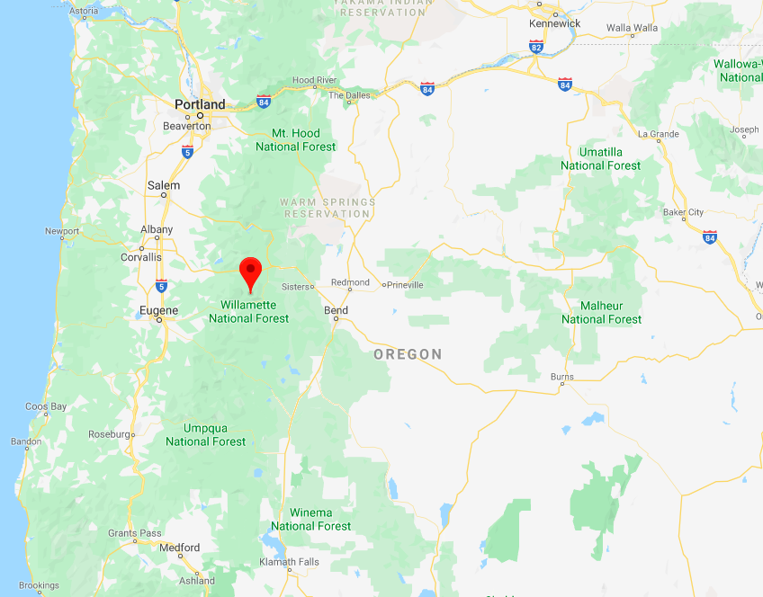

# Pacific giant salamanders in Mack Creek: comparing abundance and weight against different forest types and channel sections

#### A report for ESM 206: Statistics and Data Analysis in Environmental Science and Management

#### Ruoyu Wang & Haley Grant

#### 11/22/2019

```{r setup, include=FALSE}
knitr::opts_chunk$set(echo = FALSE, message = FALSE, warning = FALSE, fig.align = "center")

# Attach necessary packages
library(tidyverse)
library(janitor)
library(ggbeeswarm)
library(car)
library(kableExtra)
library(janitor)
library(broom)
library(ggpubr)
library(DT)
library(viridisLite)
library(effsize)
library(knitr)

# Read in raw data
mack_creek_df <- read_csv("mack_creek_vertebrates.csv") %>% 
  clean_names() %>% 
  filter(species == "DITE")
```


### Introduction

Around 1963, sections of forests near Mack Creek, Oregon, were clear cut for logging (Gregory 2016). Beginning in 1993, Stanley V. Gregory and researchers at the Andrews Forest LTER Site began studying Pacific giant salamanders (Dicamptodon tenebrosus) in the area. In the study, called "Aquatic Vertebrate Population Study in Mack Creek, Andrews Experimental Forest, 1987 to present," researchers recorded the weights of salamanders (g) and made note of their location within Mack Creek. The area is composed of clear cut and 500-year-old coniferous old growth forests. Within the two sections of forests, salamanders are found in cascades, pools and side channels. This report does not include salamanders found in isolated pools, as these areas are separated from the creek and not within the scope of this report. Studying the Pacific giant salamander population in this area is relevant to understanding how new forests- the results of logging- affect local wildlife populations, and how these effects compare to populations living in old growth forests. 


```{r  out.width = "60%"}
knitr::include_graphics("Dicamptodon_tenebrosus_2.JPG") 
```

***Figure. 1*** *Pacific giant salamander (Dicamptodon tenebrosus). Credit: Jeffrey Marsten. [Wikipedia](https://commons.wikimedia.org/wiki/File:Dicamptodon_tenebrosus_2.JPG).*

### Data and Methods

The [data set](https://portal.lternet.edu/nis/mapbrowse?packageid=knb-lter-and.4027.12) was provided by the LTER Network Data Portal, and full metadata can be found [here](https://portal.lternet.edu/nis/metadataviewer?packageid=knb-lter-and.4027.12). In the data set, sections of the forest are specified as clear cut (“CC”) and old growth (“OG”), while channel types are specified as cascade, “C”, pool, “P”, and side channel, “SC”. A Chi-Square ($\chi$^2) test was performed to determine if forest section was a determining factor in which channel type salamanders were found. Additionally, an unpaired two-sample t-test was used to determine if the weights of salamanders differed significantly between the two forest sections. Finally, a one-way ANOVA test was conducted to determine if there was significant difference in mean salamander weight among the three channel types between the two forest sections. All analyses and figures were made using R Studio version 1.2.5001.


```{r  out.width = "60%"}
 
```


***Figure. 2*** *Map of Oregon. The location of Mack Creek is designated by the red icon. Courtesy of [Google Maps](https://www.google.com/maps/place/44°13'17.3%22N+122°10'04.8%22W/@44.8758978,-124.1058318,7.57z/data=!4m5!3m4!1s0x0:0x0!8m2!3d44.2214667!4d-122.168!5m1!1e4?hl=en-US).*

### Results

#### A. Annual salamander population in two forest sections of Mack Creek.

From 2012 to 2018, the total amount of Pacific giant salamanders has changed in different trends in two different forest sections: clear cut and old growth area  (Figure.3).

```{r sections_line_graph}
# Find the counts of pacific giant salamander at OG and CC
mack_creek_a <- mack_creek_df %>% 
# filter(!notes == "Recap") %>% whether to minus these data or not
  group_by(year, section) %>% 
  summarize(
    total_count = n()
    )

# Made a colorblind-friendly palette.
cbPalette <- c("#E69F00", "#56B4E9", "#009E73", "#0072B2", "#CC79A7")

# Visualize the results
ggplot(data = mack_creek_a, 
       aes(x = year, y = total_count, 
           color = section, pch = section)) +
  geom_point(show.legend = FALSE,
             size = 3) +
  geom_line(show.legend = FALSE,
             width = 1) +
  labs(x = "Year",
       y = "Annual population in forest sections")+
  annotate("text", 
           x = c(2018.5,2019), 
           y = c(380, 335), 
           label = c("Clear Cut", "Old Growth"),
           color = c("#E69F00", "#56B4E9"),
           fontface =2)+
  scale_color_manual(values = cbPalette) +
  scale_x_continuous(limits  = c(1993,2019.5),
                     breaks = c(1993, 1998, 2003, 2008, 2013, 2017))+
  theme_minimal() 

```
***Figure. 3*** *Annual counts of salamanders in Mack Creek from 1993 to 2017. Counts in clear cut forests (orange dotted line) tended to be less than counts in old growth forests (blue line with trianges) until 2015. Data: Andrews Forest LTER Site.*

#### B. Salamander abundance by channel classification and forest sections in 2017.

Table of 2017 salamander counts by channel classification (Pool, Cascade and Side Channel) in old growth (OG) and clear cut (CC) sections of Mack Creek.


***Table. 1*** *Summary table of 2017 salamander counts by channel classification (pool, cascades and side-channel) in old growth (OG) and clear cut (CC) sections of Mack Creek. Data: Andrews Forest LTER Site.* 

```{r b_props_table}

# Find the counts of salamander by channel classification (Pool, Cascade and Side Channel) in old growth (OG) and clear cut (CC) sections of Mack Creek in year 2017.

salam_channel_count <- mack_creek_df %>% 
  filter(unittype %in% c("C", "P", "SC")) %>% 
  filter(year == "2017") %>% 
  group_by(unittype, section) %>% 
  summarize(
    count = n()
  ) %>% 
  mutate(section = ifelse(
    section == "OG",
    "Old Growth",
    "Clear Cut"
  ))

# Change the dataframe into wide format.
channel_section_table <- salam_channel_count %>% 
  pivot_wider(names_from = unittype, values_from = count) 

# Calculate the propotions within the dataframe.
channel_section_props <- channel_section_table %>% 
  janitor::adorn_percentages(denominator = "col") %>% 
  # not sure the denomincator should be the column or the row
  adorn_pct_formatting(digits = 0) %>% 
  adorn_ns(position = "front") 

# Put the results in a nice kable.
channel_section_props %>% 
  kable(
    col.names = c("Section", "Cascade","Pool", "Side Channel"),
    align = "cccc"
  ) %>% 
  kable_styling(bootstrap_options = "striped", 
                full_width = F,
                position = "center") %>% 
  add_header_above(c("Salamander counts by channel and sections classification in 2017" = 4))

```

#### C. Association between channel classifications and forest sections on mean salamanders weights.


Is there a significant difference in where in the channel Pacific giant salamanders are located (pool, cascade or side channel) between the two sections (old growth and clear cut)? 

We use Chi-Square ($\chi$^2^) test to compare proportions.

Null hypothesis: No association between channel classification and different forest sections. It is independent between the variables.

Alternative hypothesis: association between variables.

```{r c_chi_test}

# Chi-square test for independence

# A. First, get just a contingency table of counts we just want the four count values in a df, nothing else: 
salam_chi_counts <- channel_section_table %>% 
  select(-section)

# B. Run a chi-square test
my_salam_chi <- chisq.test(salam_chi_counts)

```


Since p > 0.05, we retain the null hypothesis that channel locations and sampling sections are independent. We could conclude that the channel location and two sections are independent. In other words: "There are no significant differences in forest condition (clear cut / old growth) based on where in the channels salamanders are found ($\chi$^2^(`r my_salam_chi$parameter`) = `r round(my_salam_chi$statistic,2)`, *p* (`r round(my_salam_chi$p.value,3)`) > 0.05)."


#### D. The influence of forest sections on Pacific giant salamanders weights.

The mean weight of salamanders in old growth and clear cut sections of the forest were not significantly different in 2017 (Figure 4). 

```{r d_ttest_graph}
# Specify the data to be tested
mack_creek_d <- mack_creek_df %>%
  filter(year == 2017) %>% 
  select(section, weight)

# Summary table for different sections of forest.
forest_summary_table <- mack_creek_d %>% 
  group_by(section) %>% 
  summarize(
    mean = mean(weight, na.rm = TRUE),
    sd = sd(weight, na.rm = TRUE),
    count = n()
  )


# Visulize the two groups of data
ggplot()+
  geom_histogram(data = mack_creek_d,
                 aes(x = weight, 
                     fill = section,
                     color = section),
               show.legend = FALSE,
               alpha = 0.4,
               binwidth = 1)+
  labs(x = "Weight (g)", y = "Count")+
  geom_vline(data = forest_summary_table,
             aes(xintercept = mean,
                 colour = section),
             linetype = "dashed",
             size = 1,
             show.legend = FALSE)+
  scale_y_discrete(expand = c(0,0)) +
  scale_color_manual(values = cbPalette) +
  annotate("rect", xmin = 53, xmax = 74, 
           ymin = 54, ymax = 82, 
           fill = "white",
           color = "grey40",
           alpha = 0) +
  annotate("text", x = 64, y = 78, 
           label = "Sections", 
           size = 5, color = "black") + 
  annotate("text", x = 67: 67, y = c(60, 70), 
           label = c("Clear cut", "Old growth"), 
           size = 4, color = c("#E69F00", "#56B4E9")) +  
  annotate("rect", xmin = 55, xmax = 60, 
           ymin = 57, ymax = 62, 
           fill = "#E69F00",
           color = "#E69F00",
           alpha = 0.4) +
  annotate("rect", xmin = 55, xmax = 60, 
           ymin = 67, ymax = 72, 
           fill = "#56B4E9",
           color = "#56B4E9",
           alpha = 0.4) +
  theme_minimal()
```
***Figure. 4*** *Data: Andrews Forest LTER Site.*

```{r d_ttest}
# Perform a t.test
# null hypothesis: means are equal (difference in means = 0)
# alternative hypothesis: means are not equal

sectiont_ttest <- t.test(data = mack_creek_d, weight~section)

# effect size with cohen's d
section_d <- effsize::cohen.d(data = mack_creek_d, weight~section, na.rm = TRUE)

```

In year 2017, mean weight of Pacific giant salamanders (g) measured in clear cut forests (`r round(forest_summary_table$mean[1], 2)` $\pm$ `r round(forest_summary_table$sd[1], 2)`, n = `r forest_summary_table$count[1]`) did not have significant difference from the average salamander weight in old growth forest areas (`r round(forest_summary_table$mean[2], 2)` $\pm$ `r round(forest_summary_table$sd[2], 2)`, n = `r forest_summary_table$count[2]`) by a unpaired two-sample t-test (t(`r round(sectiont_ttest$parameter, 2)`) = `r round(sectiont_ttest$statistic, 2)`, *p*(`r round(sectiont_ttest$p.value, 3)`) > 0.05) . The difference in mean weight between the two groups is 1.20 mm, with a negligible effect size (Cohen's d = `r round(section_d$estimate, 2)`). Therefore, we consider the salamander weights in clear cut areas were not significantly different from old growth ones. Histogram presented in Figure.4.

#### E. The influence of channel classifications on Pacific giant salamanders weights.

```{r e_df_sumtable}

# Only consider the channel type as a factor here
mack_creek_e <- mack_creek_df %>%
  filter(year == 2017) %>% 
  filter(unittype %in% c("C","P","SC")) %>% 
  select(weight, unittype) %>% 
  mutate(unittype = case_when(
    unittype == "C" ~ "Cascade",
    unittype == "P" ~"Pool",
    TRUE ~ "Side Channel"
  )) 

# Create a summary table
channel_summary_table <- mack_creek_e %>% 
  group_by(unittype) %>% 
  summarize(
    mean = mean(weight, na.rm = TRUE),
    sd = sd(weight, na.rm = TRUE),
    se = sd(weight, na.rm = TRUE) / sqrt(n()),
    var = var(weight, na.rm = TRUE),
    count = n()
  )
channel_summary_table
```

**1. Visually compare Pacific giant salamander weights between the three channel classifications.**

```{r e_channel_beeswarm}
# make a graph
ggplot() +
  geom_beeswarm(data = mack_creek_e,
                aes(x = unittype, 
                    y = weight,
                    color = unittype),
              width = 0.2,
              alpha = 0.5,
              show.legend = FALSE) +
  labs(y = "Weight (g)",
       x = "Channel classifications") + 
  geom_errorbar(data = channel_summary_table,
                aes(x = unittype,
                    ymin = mean - sd,
                    ymax = mean + sd),
                color = "grey35",
                size = 0.7,
                width = 0.1)+
    geom_point(data = channel_summary_table,
             aes(x = unittype,
                 y = mean),
             color = "grey30",
             size = 3,
             show.legend = FALSE)+
 # geom_hline(data = channel_summary_table,
 #           aes(yintercept = mean,
 #              colour = unittype),
 #         linetype = "dashed",
 #        size = 0.6,
 #       show.legend = FALSE)+
  scale_color_manual(values = c("#009E73", "#0072B2", "#CC79A7"))+
  theme_minimal()+
  coord_flip()

```

***Figure. 5*** *The grey points showed the mean weights within each channel groups, the error bar indicates the standard diviation of the data. Data: Andrews Forest LTER Site.*
 

**2. Is there a significant difference in mean weights for Pacific giant salamanders observed in Pool vs. Cascade vs. Side Channel in 2017?**

***Table. 2*** *The summary table for different channel classification of mean weights in Pacific giant salamanders. Data: Andrews Forest LTER Site.*
```{r e_channel_kable}

# check variances
channel_summary_table %>% 
  kable(col.names = c("Channel", "Mean","Standard Deviation","Standard Error","Variance", "Sample Size"),
        align = "cccccc",
        digits = 2
        ) %>% 
  kable_styling(bootstrap_options = "striped", 
                full_width = F,
                position = "center",
                row_label_position = c
                )%>% 
  add_header_above(c("Channel mean weight (g) Summary Table" = 6))

```


```{r e_levene_test}
# Levene's statistical test for equal variance:

levene_e <- leveneTest(weight ~ unittype, data = mack_creek_e)

# not significant, retain null hypothesis meaning that there is no significate difference between the variances between different groups. 
```

We adopted the one-way analysis of variance (ANOVA) to solve that problem. 

First, we made our hypothesizes. 
Null Hypothesis: The mean weights of Pacific giant salamanders from Pool, Cascade, and Side Channel are the same. Alternative Hypothesis: At least two group means are NOT equal.

Second, we check whether the data satisfy the three assumptions for ANOVA: 

a) The sample distribution should be normal. Through the beeswarm plot we could observe that most weights were concentrated at 0-6g. The data was presented as stew to the left side. However, the sample sizes within each groups (Pool - `r channel_summary_table$count[2]`, Cascade - `r channel_summary_table$count[1]`, and Side channel - `r channel_summary_table$count[3]`) are all more than 30, which could be considered as large enough. So the distributions of the sample statistics (mean, median) will be normally distributed.

b) Samples are independent. Due to the different locations of these three channels, the sample data collected from different places should be independent.

c) Population variances are equal. In the summary table (Table.2), notice that the largest variance (Pool - `r round(channel_summary_table$var[2], 2)`) is less than the four times of the smallest variance (Side Channel - `r round(channel_summary_table$var[3], 2)`), which means the variances are close enough. Besides, based on the results from Levene's Test (Levene's F(`r round(levene_e[[1,1]], 2)`) = `r round(levene_e[[1,2]], 2)`, *p* = `r round(levene_e[[1,3]], 3)` > 0.05), there is no significant difference in variances between groups.

Therefore, the ANOVA analysis is suitable for this question.


```{r e_anova}
# Run one-way ANOVA to compare group means

# null hypothesis: no significant difference across groups
# alternative hypothesis: significant difference across groups

aov_e <- aov(weight ~ unittype, data = mack_creek_e)

# There is significant difference in means across groups.

# run post-hoc Tukey's

post_hoc_e <- TukeyHSD(aov_e)

# SC-P is significantly different. 

# reporting outcomes

aov_e_outcomes <- unlist(summary(aov_e))
```


Of the three groups, mean salamander weight differed significantly between Side Channel and Pool (one-way ANOVA with post-hoc Tukey's HSD, F(`r aov_e_outcomes[1]`, `r aov_e_outcomes[2]`) = `r round(aov_e_outcomes[7],2)`, *p* = `r round(aov_e_outcomes[9],3)`).

```{r effect_size_cohens_d}
# pairwise cohen's d tests

# compairing Side Channel - Pool
# filter channels

side_channel_Pool_e <- mack_creek_e %>%
  filter(unittype %in% c("Pool", "Side Channel"))

# cohen's d test

cohen_d_side_channel_Pool <- cohen.d(data = side_channel_Pool_e, weight~unittype)

cohen_d_side_channel_Pool
```

The effect size was small between Side Channel and Pool samples: .


The actual difference of mean weights between salamanders found in Pool and salamanders equals

**3. Limits about comparing means across the groups.**

Mean is a measurement that is easily swayed by outliers, and it looks like the data has significant outliers. It may be more beneficial to also compare medians as well to make sure that outliers aren't affecting the accuracy of our results. This could be done through rank-based tests. 

### Summary

- 
-
-

### References 

Gregory S. V. 2016. Aquatic Vertebrate Population Study in Mack Creek, Andrews Experimental Forest, 1987 to present. Environmental Data Initiative. https://doi.org/10.6073/pasta/5de64af9c11579266ef20da2ff32f702. Dataset accessed 12/03/19. 


